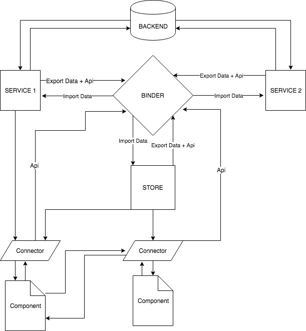

# mobx-pack
Library for building an application architecture with multiple stores and Mobx

# Installation

`npm install mobx-pack --save`

## Introduction

When creating web applications on React, the question arises - which state manager to use
to develop an application. If there are no specific requirements for the application,
then it's reasonable to take the most popular option, for example, Redux and this is an excellent choice, although if you are still
confuses a single repository, a lot of superfluous code, possible performance losses, the difficulty of dividing application on a part 
with asynchronous loading, that is sense to look at alternative variants.
 
Mobx gives, simple api, high performance (in case the application is large and the number of updates can reach hundreds of times 
per second this can be a decisive factor), the ability to use the familiar OOP approach,
 a simple way to link the state to components, but Mobx does not solve the problem of organizing the data flow and
division into parts of a large application.

Mobx-pack is a small library that solves some problems of building the architecture of large applications based on Mobx.

## The problems that are solved by mobx-pack

- communication between stores, services, including in the case of asynchronous loading
- interaction with the server
- stores initialization order
- separation of ui states and business logic
- organization of access from one store to another
- dynamic store creation

## Binder
Binder is a class that links the services and stores of an application to each other. When initialized, each instance of the service
binds to the Binder and passes to it options that describe the following:


- unique name (bindAs)
- api (links to methods by which you can access the service)
- fields that need to be imported from other services (importData)
- fields that the service exports (exportData)
- waiting for the initialization of other services (waitFor)
etc.

##Services and stores
In the application, there are data structures that describe business logic, in particular models that received from the server.
This data is stored in **services**. The task of the services is the support in the actual state of the application models, data exchange
with the server, by the client. A service instance is a singleton.

There are also states that relate to the ui and can be used between different components, such states
are stored in stores and can be created dynamically when the component is mounted.

In mobx-pack there is BaseStore - this is the class that is the prototype for the services and stores.

## Service Life Cycle

To initiate a service, the method `service.start("entryPoint")`, which return Promise, 
since the service could send requests to initiate data, till it is starting. 
The `start` method takes the string identifier of the service initiator as an argument. While calling this
The service method is bound to the Binder and reports itself to other parts of the application.
There is also a method `service.stop (" entryPoint ")` in order to unsubscribe from Binder, close the socket connection etc.. 
The `stop` method takes the string identifier of the service initiator as an argument. 
In the service there are methods `onStart` and` onStop`, for describing the corresponding actions.

```javascript
class UserService extends BaseStore {
    
    @observable collection = [];
    
    onStart(){
      return fetchData().then((data)=>{
        collection = data;
      });
    }
    
    onStop(){
      collection = [];
    }
}
```


## Store Life Cycle
The only difference between store and service is that it is created dynamically when the component is mounted and also automatically
is deleted.

## Connector

Connector is a decorator wrapped in an observer (react-mobx), which takes on the input a component and options and returns a component
with additional features. The Connector can do the following:

- create store
- call `start` services and do not render components until Promise is not resolved
- collect fields from the store and the services for transfer to the component
- transfer api methods from the store to the component

```javascript
export default Connector(
  Component,
  {
    store(){
      return new Store()
    },
    helper(store) {
      return {
        name: userService.name,
        collapsed: store.collapsed,
      };
    },
    services:[ userService ]
  },
);
```

Using Connector allows you to make the components that it wraps as "low-order"
they can be reused in another environment.

## Communication between services
Service A can retrieve field values from service B, but this should be described as follows:

```javascript
class BService extends BaseStore {
  
  name = 'Alex';
  
  config = {
    bindAs: B_SERVICE,
    exportData: {
      name: 1
    },
  };
}

class AService extends BaseStore {
  config = {
    bindAs: A_SERVICE,
    importData: {
      [B_SERVICE]: {
        name: 'userName',
      },
    },
  };
}
```

When services subscribe to Binder, it does not copy data, but creates a variable in the service A `userName`, which
is a readOnly reference to the field `name` of the service B, when the service is unbinded, Binder deletes the links.
Since this is a link, then the variable can be used in observe (mobx) and the reactions to their change will work.

You can change the service from the outside only by calling the callApi method, which calls the api of another service:

```javascript
class BService extends BaseStore {
  
  name = 'Alex';
  
  config = {
    bindAs: B_SERVICE,
  };
  
  api = {
    setName: this.setName,
  };
  
  @action setName(value){
    this.name = value;
  }
}

class AService extends BaseStore {
  config = {
    bindAs: A_SERVICE,
  };
  
  someMethod(){
    this.callApi(B_SERVICE, 'setName', 'Piter');
  }
}
```
To be notified about the initialization of another service, you can use the callback:

```javascript
class AService extends BaseStore {
  config = {
    bindAs: A_SERVICE,
    onBind:[
      [B_SERVICE, C_SERVICE, ()=>{
          alert('!')
      }]
    ]
  };
}
```

## The order of services initialization

Sometimes when one service depends on another, it is necessary that the `onStart` service be called after another service
started, for this you can use the waitFor construct:

```javascript
class AService extends BaseStore {
  config = {
    bindAs: A_SERVICE,
    waitFor:[B_SERVICE, C_SERVICE]
  };
  onStart(){
    // B_SERVICE and C_SERVICE are already started
    return true;
  }
}
```

## Modifying data from components
As mentioned above, the components through Connector subscribe to the application state change, observer calls
forceUpdate, when the observed fields change, but to change something in the state, the component must call the api method
of the store, but services api is not available to components, only for stores and other services:

```javascript

class Store extends BaseStore {
  config = {
    bindAs: 'Store',
  };
  
  @observable collapsed = false;
  
  api={
    toggle: this.toggle
  };
  
  @action toggle(){
    this.collapsed = !this.collapsed;
  }
}

const Component = ({ collapsed, api }) => (
  <div className={collapsed ? '-collapsed' : ''}>
    <button onClick={api.toggle}>Toggle</button>
  </div>
);

export default Connector(
  Component,
  {
    store() {
      return new Store();
    },
    helper(store) {
      return {
        collapsed: store.collapsed,
      };
    },
  },
);
```

## Data flow scheme


##Links
- <a href="https://github.com/alexander812/mobx-pack-starter" target="_blank">Boilerplate project</a>
- <a href="https://opencollective.com/mobx/sponsor/0/website" target="_blank">Mobx</a>
